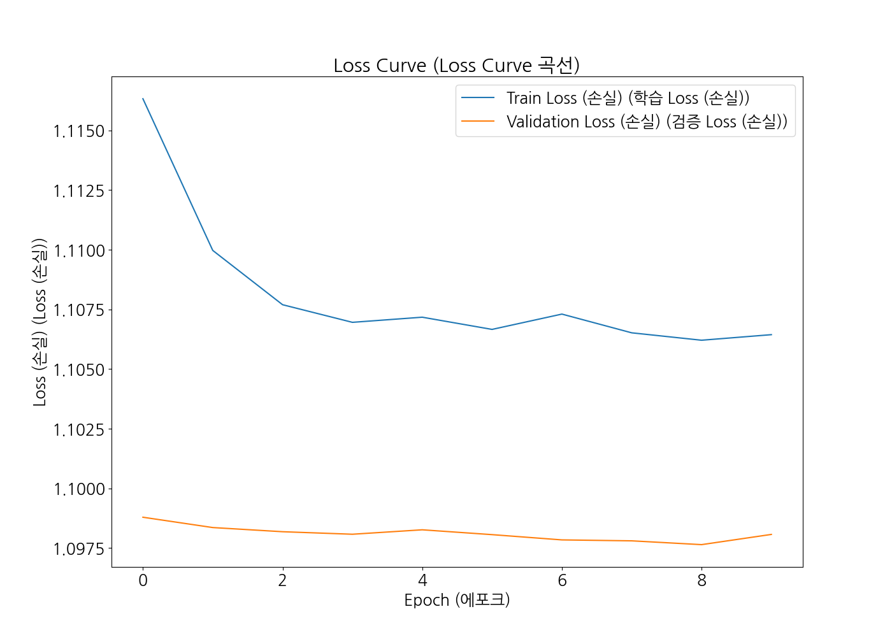
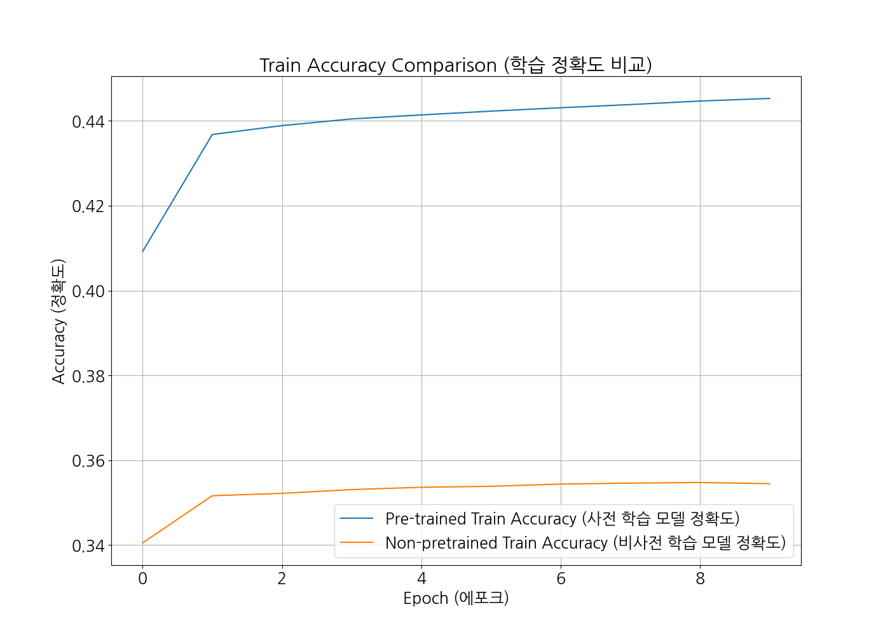
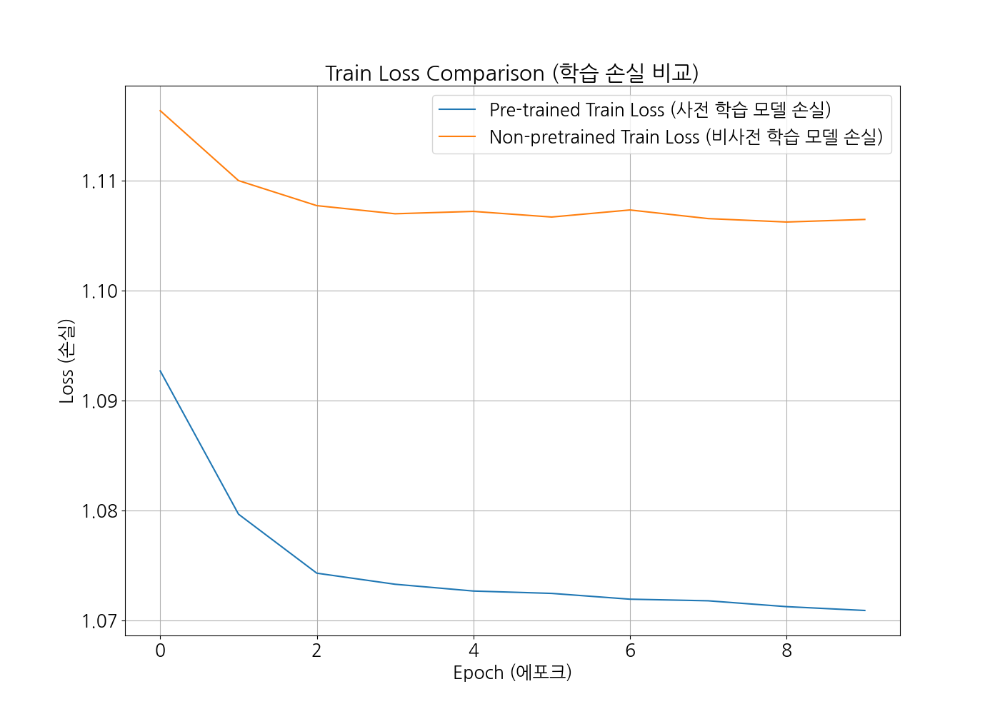

## Q1) 어떤 task를 선택하셨나요?
> ### MNLI(Multi-genre natural language inference)  
> [3주차 심화과제 링크](https://github.com/mc-friday/hanghaeAI/blob/main/week-3/%5B3%EC%A3%BC%EC%B0%A8%5D%EC%8B%AC%ED%99%94%EA%B3%BC%EC%A0%9C.ipynb)

## Q2) 모델은 어떻게 설계하셨나요? 설계한 모델의 입력과 출력 형태가 어떻게 되나요?
> ### 모델 설계  
>   - 기본 구조: Hugging Face의 DistilBERT를 백본(backbone)으로 사용한 분류 모델.  
>   - Classifier Head: DistilBERT의 출력 [CLS] 토큰을 입력으로 받아 3개의 클래스를 예측하는 Fully Connected Layer를 설계
> ### 입력
> - input_ids: 문장의 Tokenized ID로 구성된 Tensor 크기: (batch_size, max_len)
> - attention_mask 토큰이 실제 유효한지 여부를 나타내는 Tensor. 크기: (batch_size, max_len)
>   - 값이 1이면 유효한 토큰, 0이면 패딩
> ### 출력
>   - Logits: 크기 (batch_size, 3)의 Tensor
>     - 각 행은 세 개의 값으로 구성되며, 이는 Entailment, Neutral, Contradiction 각각의 점수(Logit)를 나타냄
>   - Softmax 확률: 필요시 Softmax를 통해 Logits를 확률로 변환

## Q3) 어떤 pre-trained 모델을 활용하셨나요?
> ### DistilBERT (distilbert-base-uncased)
> ### 특징
> - BERT 모델을 압축하여 경량화
> - 적은 파라미터 수로도 높은 성능 유지
> - 자연어 이해 태스크에 적합한 사전 학습(Pre-trained) 모델

## Q4) 실제로 pre-trained 모델을 fine-tuning했을 때 loss curve은 어떻게 그려지나요? 그리고 pre-train 하지 않은 Transformer를 학습했을 때와 어떤 차이가 있나요? 
> ### pre-trained 모델을 fine-tuning했을 때Loss Curve
> 
>
> ### pre-train 하지 않은 Transformer를 학습했을 때 차이점
>   - #### Fine-tuned 모델:
>     - 초기 학습 단계에서 Loss가 빠르게 감소.
>     - 최종적으로 더 낮은 Loss와 높은 정확도를 달성.
>   - #### on-pretrained 모델:
>     - Loss가 천천히 감소하며 초기 학습 효율이 낮음.
>     - 최종 성능도 Fine-tuned 모델에 비해 떨어짐.
>   - #### 이유
>     - Fine-tuned 모델은 이미 대규모 데이터로 학습된 언어 표현을 활용하므로, 더 빠르고 효과적으로 수렴
> #### Pre-trained와 Non-pretrained 모델의 학습 정확도 결과를 비교
> 
>
> #### Pre-trained와 Non-pretrained 모델의 학습 손실 결과를 비교
> 