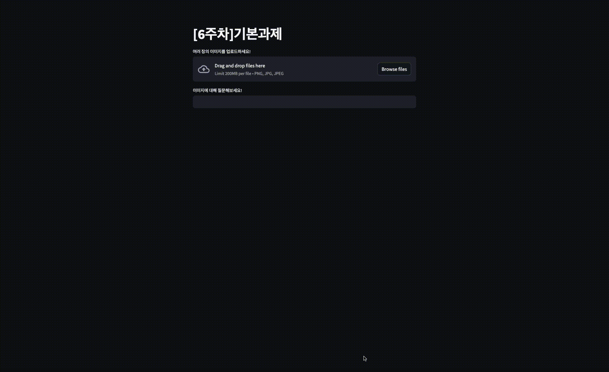

# [6주차] 기본과제: 이미지를 가지고 질의응답을 진행할 수 있는 챗봇 구현

## 📌 과제 목표

**여러 이미지를 업로드하고, 사용자 질문에 대해 OpenAI의 Vision 모델을 활용하여 응답하는 챗봇**을 구현

## 🛠 주요 기능

✅ 여러 장의 이미지 업로드 가능  
✅ 업로드된 이미지를 유지하면서 질의응답 가능  
✅ 질문 → "생각중입니다..." → 답변 순으로 처리  
✅ 이전 대화를 유지하며 다음 질문을 받을 수 있도록 처리  

## 🔧 구현 방식

### 📌 **1. 이미지 업로드 및 인코딩**

- `st.file_uploader()`를 사용하여 다중 이미지 업로드 기능 구현
- `base64.b64encode()`를 사용하여 이미지 데이터를 Base64로 인코딩 후 OpenAI API에 전달

### 📌 **2. 사용자 질문 처리**

- `st.text_input()`을 사용하여 사용자 입력을 받음
- `st.session_state`를 활용하여 이전 대화 히스토리를 유지
- 사용자가 질문을 입력하면 "생각중입니다..." 메시지를 먼저 출력한 후 OpenAI API 호출

### 📌 **3. 챗봇 응답 흐름 개선**

- OpenAI API 호출 후 응답을 출력하며 대화 히스토리에 추가
- 
### 📌 **4. 세션 관리 개선**

- `st.session_state.waiting_for_response`를 활용하여 질문 → 답변 순서 보장
- `st.session_state.last_question`을 통해 최신 질문을 저장하고 처리

## 🖥 실행 방법

```sh
# 실행
python -m streamlit run [6주차]기본과제.py
```

## 🎥 실행 화면

업로드한 강아지 🐶, 고양이 🐱 사진을 기반으로 다음과 같은 질의응답이 가능함:  
1️⃣ **"주어진 두 사진의 공통점이 뭐야?"** → 챗봇이 공통적인 특징 설명   
2️⃣ **"주어진 두 사진의 차이점이 뭐야?"** → 챗봇이 두 이미지의 차이점 분석




